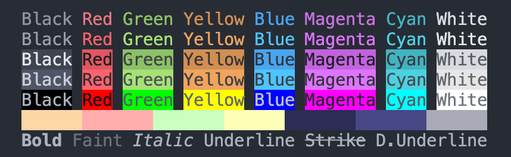

# ChromaTerm
A golang wrapper for [ANSI Escape Codes](http://en.wikipedia.org/wiki/ANSI_escape_code#Colors) that simplifies console text styling as well as other control codes.
This is an MVP that I would like to develop further. I'm currently thinking of a kind of UI library where layouts and various components can be defined. In this way I would like to simplify/enable the building of CLI UIs (e.g. like [k9s](https://github.com/derailed/k9s?tab=readme-ov-file)).
There are already some approaches like [goterm](https://github.com/buger/goterm?tab=readme-ov-file).
But it still might be fun so let's see.

# DOCs
* [ANSI](pkg/ansi/ansi.md)
  * [3&4-bit color](pkg/ansi/color/4b.md)
  * [8-bit color](pkg/ansi/color/8b.md)
